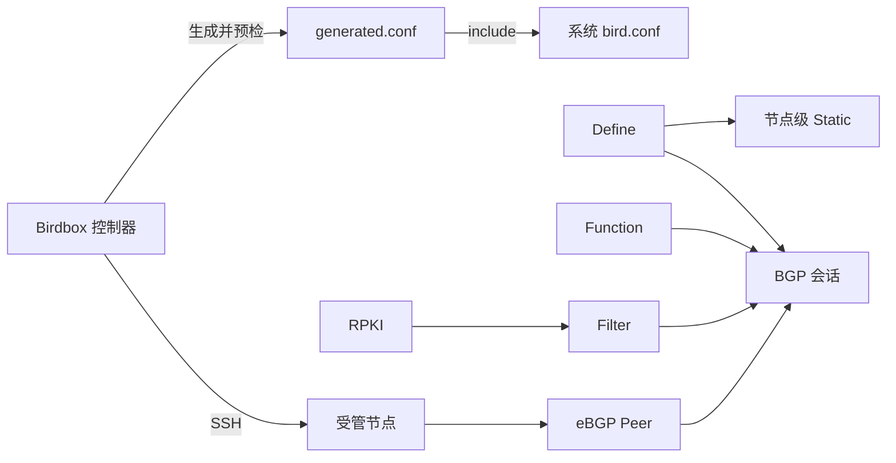

# Birdbox 用户 Wiki

Birdbox 是一个面向 BIRD 2 的 Web 控制台。它通过 SSH 管理路由节点，在浏览器中完成 eBGP Peer、BGP 会话、CIDR Define、Static Protocol、Function、Filter 和 RPKI 资源的配置、预检与部署。

Birdbox 只维护目标节点上的独立 Include 文件，不会用自己的配置替换系统 BIRD 主配置。每次变更都会先在目标节点上检查完整配置，通过后才切换生成文件并执行 `configure`。

## 适用场景

- 集中管理多个 BIRD 2 路由节点；
- 为 IPv4、IPv6 eBGP 会话维护一致的配置流程；
- 通过可视化策略、Function 和 Filter 组合导入导出策略；
- 管理节点级静态路由和 RPKI 数据源；
- 在变更前使用目标节点的原生 BIRD 进行预检；
- 需要部署锁、失败回滚和进程重启后的部署恢复。

## 配置关系

一个 Peer 只属于一个节点，一个节点与同一个 Peer 只能有一个会话。Static 是节点级资源，不属于某个 BGP 会话。Define、Function、Filter 和 RPKI 可以设为全局资源，也可以限制到多个指定节点。

## 推荐阅读顺序

1. [[快速开始]]：从空环境建立第一条会话。
2. [[部署与初始化]]：完成 Docker Compose 部署和首次登录。
3. [[节点接入与退役]]：理解 Include、SSH 密钥和节点生命周期。
4. [[Peer 与 BGP 会话]]：配置会话和导入导出策略。
5. [[路由策略与资源]]、[[Static 路由]]、[[RPKI]]：管理可复用资源。
6. [[生产最佳实践]]、[[备份、升级与恢复]]、[[故障排查]]：投入生产前完成运维准备。

## 关键边界

- 当前界面只支持 SSH Include 节点；不应把容器本身当作 BIRD 节点。
- 目标节点应运行与当前版本兼容的 BIRD 2，界面高级参数按 BIRD 2.19.1 设计。
- Birdbox 生成的文件会被后续部署替换，不要直接编辑。
- Birdbox 不自动删除主配置中的 Include 行，也不自动删除目标用户的控制器公钥。
- “预检配置”不会提交库存；资源页面中的“预检、保存并应用”会直接部署到所有受影响节点。
- 生产数据可能包含 Peer 地址、ASN、TCP 认证密钥和私有策略。公开截图或提交 Issue 前必须脱敏。

## Wiki 页面

| 页面 | 内容 |
| --- | --- |
| [[部署与初始化]] | Compose、环境变量、HTTPS、首次初始化 |
| [[界面、主题与账户]] | 主题、状态、密码、多登录会话 |
| [[节点接入与退役]] | 准备脚本、known_hosts、更新和退役 |
| [[Peer 与 BGP 会话]] | Peer、会话、Address Family、策略和启停 |
| [[路由策略与资源]] | Define、Function、Filter、作用域、顺序和引用 |
| [[Static 路由]] | 逐前缀动作、Import/Export 和冲突规则 |
| [[RPKI]] | 本地 ROA 文件、RPKI-RTR、策略引用 |
| [[高级 BGP 参数]] | BGP 和 Channel 高级字段的使用边界 |
| [[生产最佳实践]] | 变更、策略、安全和可用性实践 |
| [[备份、升级与恢复]] | MySQL、SSH 数据卷、升级和回滚 |
| [[故障排查]] | 登录、节点接入、配置、部署和会话问题 |
